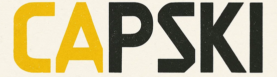

  

# Capski ~ Audio-to-Karaoke Video Tool
Capski is a command-line tool written in **Rust** that transforms audio or video files into stylized **karaoke-style** videos with real-time subtitles. The tool supports transcription, translation, and subtitle rendering with custom styling, making it ideal for content creators and educators.

## Tech Stack
- Rust
- whisper-rs
- FFmpeg for video processing
- Advanced SubStation Alpha (ASS) for subtitles

## Key Features
- Converts WAV/MP3/MP4 into karaoke-style videos
- Whisper-based transcription with real-time timing
- Optional English translation between multiple languages
- Styled subtitles via JSON config
- Burn subtitles directly into video using FFmpeg
- Simple, ergonomic CLI with helpful flags

## Engineering Requirements Document
The Engineering Requirements Document (**ERD**) is available here :

-> [ERD on Google Docs](https://docs.google.com/document/d/1xfLcfE5BA1i_wjUSHHJYuA4zneVqrm4rEg2bf_YeltQ/edit?usp=sharing)
